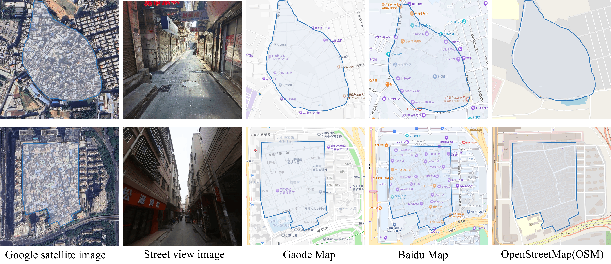

# DenseUIS Dataset

DenseUIS Dataset – First high-resolution remote sensing dataset for building and road recognition in dense urban informal settlements. Features imagery and annotations from 126 urban villages across Shenzhen &amp; Guangzhou, providing a benchmark for fine-grained urban mapping research.

As a widespread form of informal settlements, urban villages present significant challenges for sustainable urban development and governance. Precise mapping of their infrastructure is essential, however, existing remote sensing datasets primarily focus on formal urban environments, lacking fine-grained annotated data for the high-density building patterns and narrow road networks typical of urban villages. To address this gap, we introduce the *DenseUIS* dataset, the first high-resolution remote sensing dataset specifically designed for building and road extraction in extremely dense urban informal settlements, covering 126 urban villages across Shenzhen and Guangzhou in China. Furthermore, we conduct a comprehensive evaluation of state-of-the-art deep learning models on this dataset. Experimental results reveal the limitations of existing methods in handling the unique morphological patterns of dense informal settlements, underscoring the need for specialized approaches. *DenseUIS*  therefore provides a robust benchmark for advancing fine-grained urban mapping in complex and high-density informal environments. 

**📄 Our paper has been accepted by The 46th International Geoscience and Remote Sensing Symposium (IGARSS 2026). The full paper is available on [arXiv](https://arxiv.org/abs/2605.29856).**

## Overview

The DenseUIS Dataset (Dense Urban Informal Settlements Dataset) is the first high-resolution remote sensing dataset specifically designed for building and road recognition in extremely dense urban informal settlements, commonly known as "Urban Villages" (UVs).

This dataset addresses the critical gap in existing remote sensing resources, which primarily focus on formal urban structures and lack fine-grained annotations for the unique morphological patterns found in informal settlements.



## Key Features

- High-Resolution Coverage: Contains approximately 100 km² of very-high-resolution remote sensing imagery
- Geographic Scope: Covers 126 urban villages across Shenzhen and Guangzhou, China
- Detailed Annotations: Manually annotated building and road masks with fine-grained labeling
- Unique Focus: Specifically targets the challenging scenario of dense urban informal settlements
- Benchmark Utility: Provides a robust benchmark for evaluating advanced deep learning methods in fine-grained urban mapping

## Study Area

The *DenseUIS* dataset is designed to benchmark building and road extraction in complex urban environments, specifically targeting dense urban villages. To ensure model generalizability, the dataset encompasses substantial intra-class diversity in terms of building density, scale, and spatial layout. Specifically, we focus on urban villages in Shenzhen and Guangzhou, China—regions characterized by very high building density and irregular, narrow road networks.

The dataset covers 126 urban villages, sampled from Futian, Luohu, Nanshan, Bao’an, Longhua, and Longgang districts in Shenzhen, as well as from the central districts of Guangzhou, including Yuexiu, Liwan, Haizhu, and Tianhe.
The spatial distribution of the dataset samples is illustrated in Figure below


## Download Dataset

DenseUIS dataset is available at [Google Drive](https://drive.google.com/file/d/1CtvNBK91R1raklhK4LaRSERGjXi0LRSn/view?usp=share_link) or [BaiduYun](https://pan.baidu.com/s/1AbMtx_x746mQpYWKYer2Bg?pwd=2hqw) (Code: 2hqw).

## Dataset Structure

The DenseUIS dataset is organized into two sub-datasets for building and road extraction. Each sub-dataset is split into `train`, `val`, and `test` sets (700 / 100 / 200 samples), with paired remote sensing images and corresponding annotation masks.

```text
DenseUIS-data/
├── DenseUIS_building_dataset/
│   ├── image/
│   │   ├── train/   # 700 images (tile_*.png)
│   │   ├── val/     # 100 images (tile_*.png)
│   │   └── test/    # 200 images (tile_*.png)
│   └── label/
│       ├── train/   # 700 building masks (tile_*.png)
│       ├── val/     # 100 building masks (tile_*.png)
│       └── test/    # 200 building masks (tile_*.png)
└── DenseUIS_road_dataset/
    ├── image/
    │   ├── train/   # 700 images (tile_*.png)
    │   ├── val/     # 100 images (tile_*.png)
    │   └── test/    # 200 images (tile_*.png)
    └── label/
        ├── train/   # 700 road masks (tile_*.png)
        ├── val/     # 100 road masks (tile_*.png)
        └── test/    # 200 road masks (tile_*.png)
```

Each image and its corresponding label share the same filename (e.g., `image/train/tile_0.png` ↔ `label/train/tile_0.png`).

## Citation

If you find this work useful, please cite our paper.

```bibtex
@misc{long2026buildingroadrecognitiondense,
      title={Building and Road Recognition in Dense Urban Informal Settlements: A Dataset and Benchmark}, 
      author={Hongyu Long and Jiaxuan Liu and Rui Cao},
      year={2026},
      eprint={2605.29856},
      archivePrefix={arXiv},
      primaryClass={cs.CV},
      url={https://arxiv.org/abs/2605.29856}, 
}
```

## Contact

If you have any concerns, please do not hesitate to contact jliu031@connect.hkust-gz.edu.cn.
